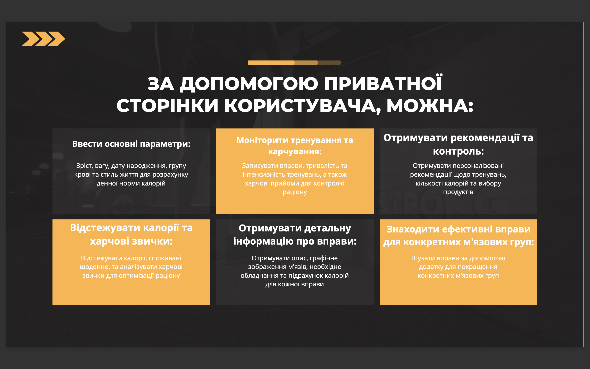
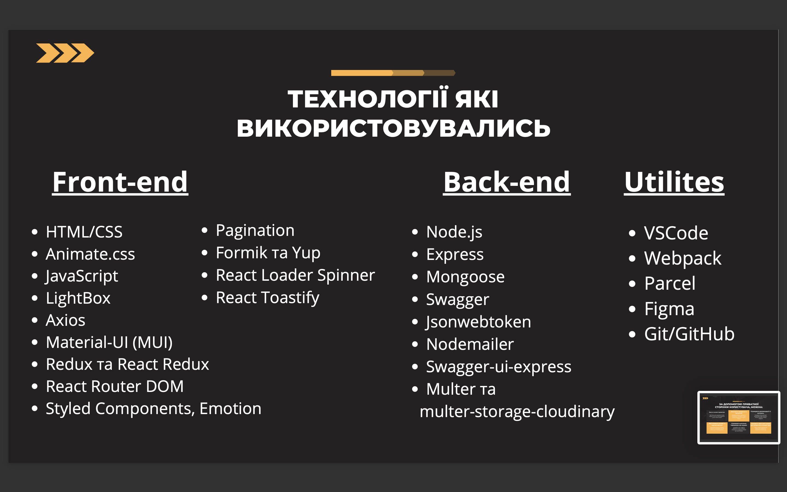

# React & Node.js Team Project






## Installation instructions

1. Clone the repository

````bash
git clone https://github.com/nightven/agua_vivo_app_backend.git

## Installation instructions

1. Clone the repository

```bash
git clone https://github.com/nightven/agua_vivo_app_backend.git
````

2. Set up dependencies

```bash
npm install
```

3. Add the .env file with the required variables.
   The required variables can be seen in the file EXAMPLE.ENV

````
4. Start the server
```bash
npm run dev
````

## Instructions for use

There are 4 main routers on our backend. To test the operation of each router, you can use [documentation Swagger](https://backend-power-pulse-7.onrender.com/api-docs).

### 1. Auth

The route responsible for the user authorization process. Its functionality includes:

- Registration
- Login to the system
- Update user information (current)
- Update avatar
- Log out of the account
- Email confirmation
- Google Authorization

### 2. Exercises

The route used to access all exercises. Here you can:

- Get all filters for exercises
- Get all exercises

### 3. Products

The route used to access all products. Here you can:

- Get all categorys for products
- Get all products

### 4. Diary

The route responsible for diary functionallity. This includes:

- Get info about eaten products and done exercises by user
- Adding products to daily meal
- Adding exercises for a day
- Deleting product or exercise from added

### 5. Statistics

This route gets user statistics.

# Backend Developers

[Backend deploy](https://backend-power-pulse-7.onrender.com/)
[Swagger Documentation](https://backend-power-pulse-7.onrender.com/api-docs)

- [Max Tsekhmaistruk **Team Lead & Developer**](https://github.com/ShoTuPalush)
- [Kateryna Kotelevska **Developer**](https://github.com/rmlyaaa)
- [Maksym Dranovskyi **Developer**](https://github.com/Maksym-nl)

# Frontend Developers

[Frontend part](https://github.com/sergeycrew/project-Power-7)
[Frontend deploy](https://sergeycrew.github.io/project-Power-7/)

- [Sergey Bodnariuk **Team Lead & Developer**](https://github.com/sergeycrew)
- [Danylo Mikheev **Project Manager & Developer**](https://github.com/CaXaR777)
- [Victoria Zherebtsova **Scrum master & Developer**](https://github.com/ilnickii)
- [Tetiana Kravchenko **Developer**](https://github.com/Avelinka)
- [Anna Samoilenko **Developer**](https://github.com/Annargb)
- [Pavel Ilnytskyi **Developer**](https://github.com/ilnickii)
- [Valery Rublevska **Developer**](https://github.com/Rublevska)
